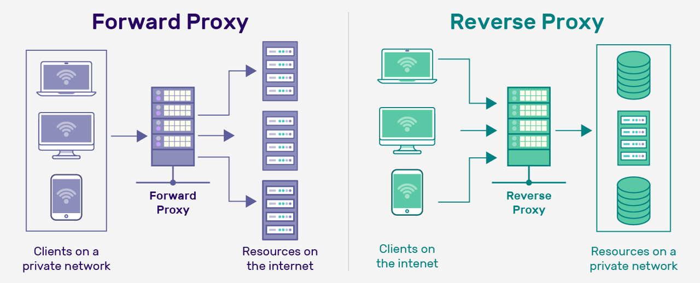
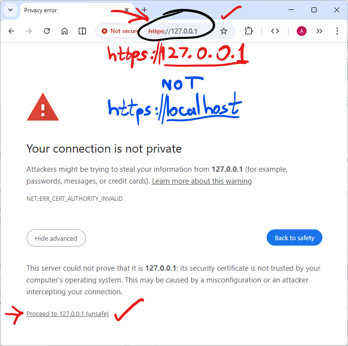

# Setting up a Production-Ready API

## Step 1: Create a Self-Signed Private Key and Public Certificate for HTTPS

**OpenSSL is a cryptographic library that developers embed into applications to implement secure protocols**—it provides the encryption engine for HTTPS, email security, VPNs, and certificate management, **but it does not provide connectivity itself**.

**OpenSSH is a complete suite of tools for secure remote access and file transfer**—it handles logins, file copying, tunneling, and port forwarding between machines, using its own independent cryptographic implementation (though it can also be configured to work with OpenSSL).

**In essence:** **OpenSSL** is the cryptographic toolkit that secures data in transit across various protocols, while **OpenSSH** is the connectivity toolset that secures remote machine access and operations—they serve different purposes, operate independently, and are not dependent on one another despite occasional integration.

Analogy: OpenSSL answers, "How do I encrypt this data?" while OpenSSH answers "How do I securely reach that machine?"

```shell
docker exec -it --user student customized-ubuntu-server-smm bash
```

<p align="left">


</p>

### Install OpenSSL in Linux

Most Linux distributions ship with OpenSSL by default because system utilities depend on it. However, assuming that there is no OpenSSL installed, below are the installation steps in a Linux Server (Ubuntu server).

Execute:

```shell
sudo apt update
sudo apt install openssl
```

Verify installation:

```shell
openssl version
which openssl
```

---

### Create a minimal OpenSSL config

Execute:

```shell
vim /home/student/openssl.cnf
```

Press `i` for **Insert Mode** in `vim` and paste the following inside the openssl.cnf file:

```text
[ req ]
default_bits       = 2048
prompt             = no
default_md         = sha256
x509_extensions    = v3_req
distinguished_name = dn

[ dn ]
C  = KE
ST = Nairobi
L  = Nairobi
O  = Teaching Lab
OU = IT Department
CN = localhost

[ v3_req ]
subjectAltName = @alt_names

[ alt_names ]
DNS.1 = localhost
DNS.2 = customized-ubuntu-server-smm
IP.1  = 127.0.0.1
```

Press `Esc` and then type `:wq` to write the changes to the file and quit `Vim`.

### Generate the public certificate using OpenSSL

Execute:

```shell
mkdir /home/student/certs
```

Run the following command in the bash terminal to generate the public certificate using OpenSSL:

```shell
openssl req -x509 -nodes -days 90 \
  -newkey rsa:2048 \
  -keyout certs/selfsigned.key \
  -out certs/selfsigned.crt \
  -config /home/student/openssl.cnf
```

Confirm that the certificate has been created:

```shell
ls -al /home/student/certs/
```

The command does the following 2 tasks:

1. Creates a new private key → **certs/selfsigned.key**
This is secret. **YOU SHOULD NOT SHARE IT PUBLICLY.**
Nginx uses it to prove that it is the server.

2. Creates a new public certificate → **certs/selfsigned.crt**
This is the self-signed certificate.
It contains the “public half” of your identity.
Browsers use it to set up encrypted communication.

Key Points to Note:

1. With a Self-Signed Certificate (our current setup for educational purposes):
We generate **both the private key (.key) and the certificate (.crt)** ourselves.
The browser says: “I do not know this Certificate Authority that issued this
certificate (you issued the certificate yourself), so I cannot trust this identity.”
Encryption works (data is scrambled), but identity is not trusted.
Anyone could generate a certificate for localhost or even google.com if it is self-signed.

2. With a Trusted Certificate Authority (real-world setup)
You create a Certificate Signing Request (CSR)
This file contains your domain name (e.g., `yourdomain.co.ke`) and your public key.
You generate the public key from your private key.
You then send the CSR to a Certificate Authority (CA)

Examples of CAs: Let’s Encrypt (free), DigiCert, GlobalSign, etc.

The CA confirms that you actually own `yourdomain.co.ke`.

The CA then signs your CSR. This produces a certificate (`yourdomain.crt`) that says:
“The CA vouches that the owner of this public key really owns `yourdomain.co.ke`.”

The difference is that browsers trust your public certificate because they already trust the CA.

You can then deploy the certificate + private key in Nginx
Example in nginx.conf:

```config
ssl_certificate     /etc/nginx/certs/yourdomain.crt;
ssl_certificate_key /etc/nginx/certs/yourdomain.key;
```

In this lab, the deployment is done when the Nginx image is built and the updated configuration ([container-volumes/nginx/nginx.conf](container-volumes/nginx/nginx.conf)) file is uploaded to the running Nginx container.

## Step 2: Use Docker Compose

The building of the images in the subsequent steps is done using the following Docker Compose files: [docker-compose.yaml](docker-compose.yaml) followed by [docker-compose-dev.yaml](docker-compose-dev.yaml). Execute the following to build the images and run the Docker containers (this enables you to perform Step 3 and Step 4):

```shell
docker compose \
  -f docker-compose.yaml \
  -f docker-compose-dev.yaml \
  up -d \
  --scale flask-gunicorn-app=2
```

Docker Compose in turn access the following two Dockerfiles to build the required images:

1. [Dockerfile.flask-gunicorn-app](images/Dockerfile.flask-gunicorn-app)
2. [Dockerfile.nginx](images/Dockerfile.nginx)

## Step 3: Create the Application Server

The application server is made up of **Gunicorn**, a Web-Server Gateway Interface (WSGI) application server.
**Gunicorn** runs in a **Python** environment to access **Flask**. Flask serves the model trained using Python through an API.


## Step 4: Create the Reverse Proxy

The reverse proxy is made up of the **NGINX** web server.


A reverse proxy:

- Terminates SSL (handles HTTPS).
- Routes requests to the right backend service (`/api` → Gunicorn, `/static` → static web files).
- Load balances between multiple backend instances.
- Caches responses (e.g., static images, JSON).
- Shields backend servers from direct exposure to the internet (security).

Build the following Dockerfile to create the NGINX web server that will be assigned the role of a reverse proxy: [Dockerfile.nginx](Dockerfile.nginx)

## Step 5: Confirm your Setup

You should be able to access the Nginx reverse proxy which is your web server, using HTTPS via [https://127.0.0.1/](https://127.0.0.1/)

**Use [https://127.0.0.1/](https://127.0.0.1/)** and NOT [https://localhost/](https://localhost/) because the API endpoint is served to the frontend through [https://127.0.0.1/api/](https://127.0.0.1/api/)

The following warning is expected in our development environment used for learning, as explained in Step 2 above (using self-signed certificates), therefore, click "Proceed to localhost (unsafe)".

