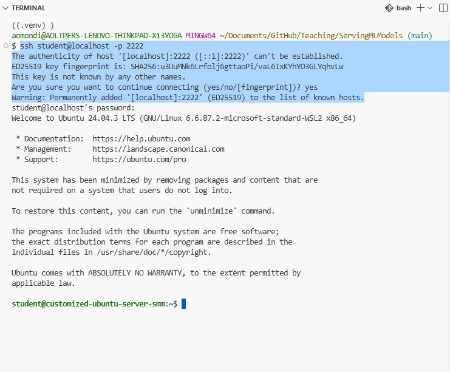
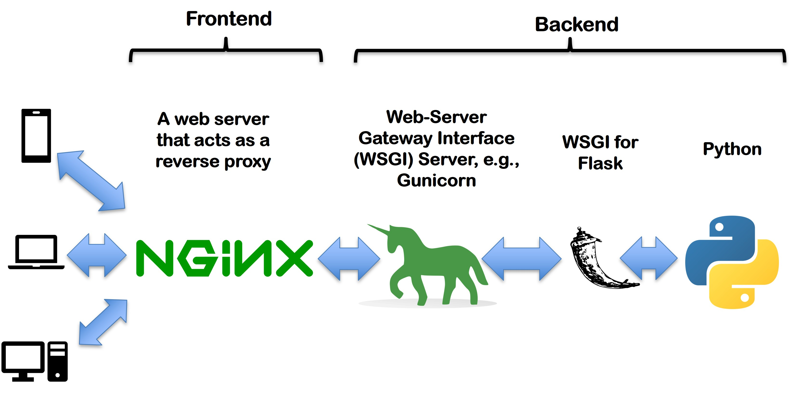
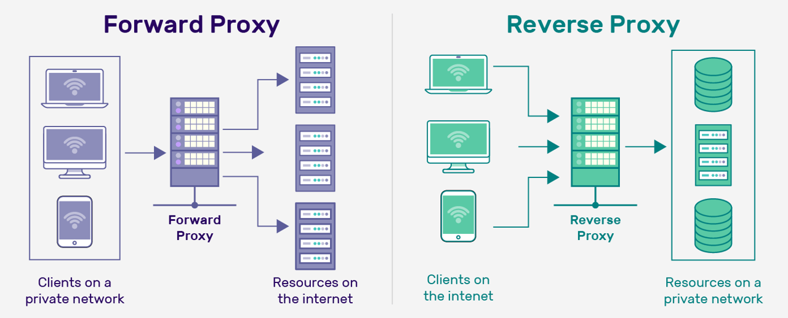

# Setting up a Production-Ready API

## Step 1.1: Create a Self-Signed Private Key and Public Certificate for HTTPS

**OpenSSL** is a cryptographic library that developers embed into applications to implement secure protocols -- it provides the encryption engine for HTTPS, email security, VPNs, and certificate management, **but it does not provide connectivity itself**.

**OpenSSH** is a complete suite of tools for secure remote access and file transfer -- it handles logins, file copying, tunneling, and port forwarding between machines, using its own independent cryptographic implementation (though it can also be configured to work with OpenSSL).

**In essence:** OpenSSL answers "how do I encrypt this data?" while OpenSSH answers "how do I securely reach that machine?" -- they serve different purposes and are not dependent on one another.

### Create the Linux (Ubuntu) Server Container

Create the following folders, which will be mapped to the container volumes:

- `container-volumes\ubuntu\home-student`
- `container-volumes\nginx\certs`

You can do this manually, or execute the `lab_setup.sh` script from
the root of the repository:

```shell
# This is executed to create the required volume directories
chmod u+x lab_setup.sh
sed -i 's/\r$//' lab_setup.sh
./lab_setup.sh
```

Create the `.env` file based on the example provided in [env.example](env.example).

Build and start just the Ubuntu container:

```shell
docker compose \
  -f docker-compose-dev.yaml \
  up -d ubuntu-server
```

Access its bash terminal:

```shell
docker exec -it --user student customized-ubuntu-server-smm bash
```

### Install OpenSSL in Linux

Most Linux distributions ship with OpenSSL by default because system utilities depend on it. Confirm it is present:

```shell
openssl version
which openssl
```

If it is missing:

```shell
sudo apt update
sudo apt install openssl
```

---

### Create a minimal OpenSSL config

```shell
vim /home/student/openssl.cnf
```

Press `i` for Insert Mode and paste:

```text
[ req ]
default_bits       = 2048
prompt             = no
default_md         = sha256
x509_extensions    = v3_req
distinguished_name = dn

[ dn ]
C  = KE
ST = Nairobi County
L  = Nairobi
O  = Class Lab
OU = IT Department
CN = localhost

[ v3_req ]
subjectAltName = @alt_names

[ alt_names ]
DNS.1 = localhost
DNS.2 = customized-ubuntu-server-smm
IP.1  = 127.0.0.1
```

Press `Esc`, then type `:wq` to save and quit.

### Generate the public certificate using OpenSSL

```shell
mkdir /home/student/certs
```

```shell
openssl req -x509 -nodes -days 90 \
  -newkey rsa:2048 \
  -keyout /home/student/certs/selfsigned.key \
  -out /home/student/certs/selfsigned.crt \
  -config /home/student/openssl.cnf
```

Confirm:

```shell
ls -al /home/student/certs/
```

This produces two files:

1. **`/home/student/certs/selfsigned.key`** -- the private key. **Never share this.** Nginx uses it to prove it is the server.
2. **`/home/student/certs/selfsigned.crt`** -- the public certificate. Browsers use it to set up encrypted communication.

**With a self-signed certificate** (our setup, for educational purposes): you generate and issue both files yourself. The browser will say "I do not know the Certificate Authority that issued this" -- encryption works, but identity is not trusted, and anyone could self-sign a certificate claiming to be `google.com`.

**With a real Certificate Authority** (production): you create a Certificate Signing Request (CSR) containing your domain and public key, send it to a CA (e.g. [Let's Encrypt](https://letsencrypt.org/) or [DigiCert](https://www.digicert.com/)), the CA verifies you own the domain, and signs the CSR. Browsers trust the result because they already trust the CA.

### Deploy the certificate + private key to Nginx

Copy the two files you just generated:

- `container-volumes\ubuntu\home-student\certs\selfsigned.crt`
- `container-volumes\ubuntu\home-student\certs\selfsigned.key`

into the **separate**, Nginx-facing folder:

- `container-volumes\nginx\certs`

These are two different bind-mounted folders on your host, feeding two different containers -- the copy is a manual step, not automatic.

[container-volumes/nginx/nginx.conf](container-volumes/nginx/nginx.conf) references these files here:

```nginx
listen 443 ssl;
server_name localhost;

ssl_certificate     /etc/nginx/certs/selfsigned.crt;
ssl_certificate_key /etc/nginx/certs/selfsigned.key;
```

**Important -- reload, do not rebuild:** both `nginx.conf` and the certs folder are mounted into the nginx container as live, read-only volumes (see `docker-compose-dev.yaml`). That means editing `nginx.conf` or replacing the certificate files does **not** require rebuilding the Nginx image. It does require telling the already-running Nginx process to re-read them:

```shell
docker compose restart nginx
```

If `https://127.0.0.1/` still shows the old certificate or the old config after a change, this is almost always the missing step.

## Step 1.2: [EXTRA] Install and Use SSH

Install and use SSH to understand the different use cases of SSL and SSH.

```shell
sudo apt update
sudo apt install -y openssh-server
```

```shell
ssh -V

# Commented out because Docker containers do not contain a full Linux OS with systemctl
# systemctl status ssh

# Instead, in a container:
sudo service ssh start
```

Access it from another terminal:

```shell
ssh student@localhost -p 2222
```



**Note:** this installation is not "baked" into `Dockerfile.ubuntu` -- it only exists inside the running container. If you recreate the container (`docker compose down` followed by `up`), you will need to repeat this step; only `/home/student` survives a recreation.

## Step 2: Use Docker Compose

```shell
docker compose \
  -f docker-compose.yaml \
  -f docker-compose-dev.yaml \
  up -d \
  --build \
  --scale flask-gunicorn-app=2
```

This builds and starts all three services: `flask-gunicorn-app` (scaled to 2 replicas), `nginx`, and `ubuntu-server`.

Docker Compose uses two Dockerfiles here:

1. [Dockerfile.flask-gunicorn-app](dockerfiles/Dockerfile.flask-gunicorn-app)
2. [Dockerfile.nginx](dockerfiles/Dockerfile.nginx)

**After scaling, restart Nginx once.** Nginx resolves the `flask-gunicorn-app` hostname to its replicas' IP addresses a single time, when it starts -- it does not keep checking afterwards. If you change the number of replicas (`--scale flask-gunicorn-app=2`) *after* Nginx is already running, tell it to look again:

```shell
docker compose restart nginx
```

Doing the scale and the (re)start of Nginx as two separate steps, in that order, avoids a timing race where Nginx might start before all replicas are visible to it and permanently miss one.

## Step 3: Create the Application Server

The application server is made up of **Gunicorn**, a Web-Server Gateway Interface (WSGI) application server. **Gunicorn** runs in a **Python** environment to host **Flask** -> Flask serves the model, trained in Python, through an API.



## Step 4: Create the Reverse Proxy

The reverse proxy is made up of the **NGINX** web server.



A reverse proxy:

- Terminates SSL (handles HTTPS).
- Routes requests to the right backend service (`/api/` -> Gunicorn, `/` -> static frontend files).
- Load balances between multiple backend instances.
- Shields backend servers from direct exposure to the internet.

**One consequence worth noticing:** once the frontend and the API are both served through this same Nginx origin (`https://127.0.0.1/`), they are no longer on different origins the way they were in the earlier, direct-to-Flask stage of this lab. If your frontend JavaScript still calls an absolute address like `http://127.0.0.1:5000/api/...`, that call will fail outright, because port 5000/8000 is never published to your host in this setup (see `docker-compose.yaml`'s `expose:` comment) -- the only route to the API now is through Nginx. Update each frontend page's API call to a **relative** path instead:

```javascript
const API_URL = "/api/v1/models/sme-revenue-regressor/predictions";
```

A relative path is automatically resolved against whatever origin served the page -- so the same file works correctly once it is served through Nginx, with no CORS configuration needed at all (frontend and API are now the same origin).

## Step 5: Confirm your Setup

You should now be able to reach the Nginx reverse proxy over HTTPS at [https://127.0.0.1/](https://127.0.0.1/) or [https://localhost/](https://localhost/). Requesting the plain `http://` address on port 80 will redirect you to the secured site automatically.
