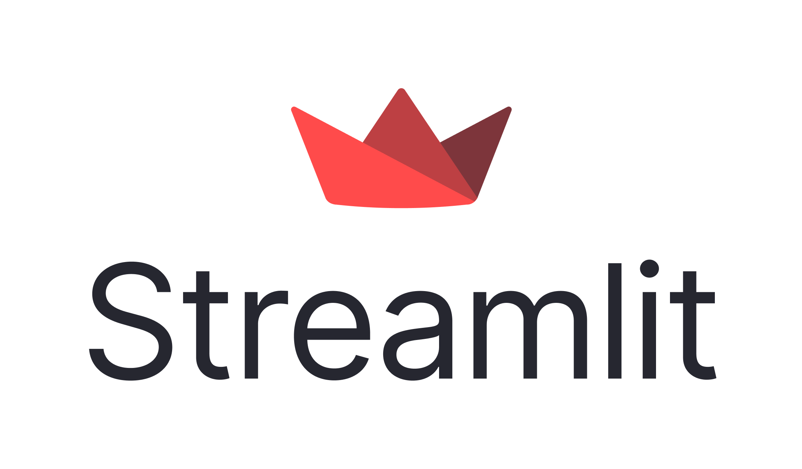

# Publicly Serving the Model for Validation by Domain Experts

There are several free or freemium platforms and techniques that developers can use to demo models (e.g., models saved as `.joblib` files).

Domain experts can then use these platforms to validate the model and provide the developer with feedback before the model is deployed in a production environment.

Examples:

<p align="left">

</p>

1. **Hugging Face Spaces – [https://huggingface.co/spaces](https://huggingface.co/spaces)**

    Hugging Face offers a collaborative platform for hosting and sharing machine learning demos. Developers can deploy models easily using Gradio or Streamlit as frontends, with Hugging Face handling the hosting. It is particularly popular in the research and NLP communities because of its integration with the Hugging Face model hub. Domain experts can interact with the model through a simple web UI, making it ideal for quick prototyping and validation.

<p align="left">

</p>

2. **Streamlit Community Cloud (formerly Streamlit Sharing) – [https://share.streamlit.io](https://share.streamlit.io)**

    Streamlit's official hosting platform allows developers to deploy Python applications directly from a GitHub repository. It is designed to be simple and developer-friendly, with automatic updates whenever the repository changes. Streamlit Community Cloud is well-suited for lightweight data apps, dashboards, and interactive ML demos. Domain experts can test models via a familiar, user-friendly Streamlit interface.

<p align="left">

</p>

3. **Render – [https://dashboard.render.com/](https://dashboard.render.com/)**

    Render is a general-purpose cloud platform for deploying web applications and APIs. Unlike Hugging Face Spaces and Streamlit Community Cloud, which focus on demos, Render is closer to production-grade deployment. It supports Flask, FastAPI, and Django apps, making it **ideal for exposing a trained model as an API endpoint** (for Postman or integration with other systems). Render's free tier requires a $1 card-verification charge, and free web services **sleep after 15 minutes of inactivity** (the first request afterwards takes 30-60 seconds to wake it up -- see Expected Challenges below).

Amongst many other alternative services for hosting your model.

---

## Which models are we demoing?

This lab's `api.py` serves **four** artifacts (regression, classification, clustering, and association-rule recommendations), each a full scikit-learn / imbalanced-learn Pipeline or a precomputed lookup, loaded from `./model/*.joblib`.

All three platforms below now demo **all four models**, presented differently on each because of what each platform actually is:

- **Hugging Face Spaces** and **Streamlit Community Cloud** are single-page demo UIs, so "all four models" means one `app.py` with a **tab per model** (`gr.Tab` in Gradio, `st.tabs` in Streamlit). A domain expert opens one URL and switches tabs to try a different model -- nothing to link between, nothing extra to deploy.
- **Render** is not a UI at all -- it is your REST API. All four routes in `api.py` are already reachable the moment the one service deploys; there is no separate "tab" concept for an API, and no extra step is required to "show" all four models there. The Render section below explains this distinction and gives a quick-reference list of all four endpoints, plus an optional way to give Render a browsable UI too, if you want one.

---

## Hugging Face Spaces using a Gradio App

Overall workflow:

1. Create a Gradio app with one tab per model
2. Deploy the Gradio app to Hugging Face Spaces
3. Deploy all four `.joblib` files to Hugging Face Spaces
4. Deploy the `requirements.txt` to Hugging Face Spaces
5. Run the Gradio app
6. Domain experts access the Gradio app via a web interface, switching tabs to validate each model in turn

### Step 1: Create a Gradio App (`app.py`)

`gr.Blocks()` with `gr.Tab(...)` is the Gradio equivalent of a single page with four linked panels: one shared app, one shared URL, four independent forms. Each tab loads and calls only the artifact it needs, exactly mirroring the corresponding route in `api.py`.

```python
import gradio as gr
import joblib
import numpy as np
import pandas as pd
import spaces

# -----------------------------------------------------------------------
# Hugging Face's free tier now provisions new Gradio Spaces on ZeroGPU
# hardware only (see the note in Step 2 below). None of this app's four
# models needs a GPU -- every prediction below runs on plain scikit-learn
# arrays -- but some free-tier Spaces fail to start reliably unless at
# least one function is decorated with @spaces.GPU. This function does
# nothing GPU-related; it exists only to satisfy that platform check.
# Calling it once, here, registers it before Gradio launches below.
@spaces.GPU
def _warm_zerogpu():
    return None

_warm_zerogpu()

# -----------------------------------------------------------------------
# Load all four persisted artifacts ONCE, at import time -- the same
# principle api.py uses: load once at startup, reuse across every request
# (here, across every tab and every submit click), never inside a function.
# -----------------------------------------------------------------------
regression_pipeline = joblib.load("lasso_regressor_for_sme_revenue.joblib")
classification_pipeline = joblib.load("svc_classifier_for_sme_credit_risk.joblib")

clustering_artifact = joblib.load("kmeans_mall_customer_segmentation.joblib")
clustering_scaler = clustering_artifact["scaler"]
clustering_kmeans = clustering_artifact["kmeans"]

arm_artifact = joblib.load("apriori_recommendation_rules.joblib")
recommendation_lookup = arm_artifact["recommendation_lookup"]
sku_lookup = arm_artifact["sku_lookup"]


# -----------------------------------------------------------------------
# 1. Regression -- predict monthly revenue (KES) for an SME
# -----------------------------------------------------------------------
def predict_revenue(sector, county, quarter, business_age_years, num_employees,
                     owner_education_level, monthly_marketing_spend_kes,
                     avg_daily_foot_traffic, online_presence_score,
                     loan_amount_kes, interest_rate_pct, inflation_rate_pct,
                     competitor_density, customer_satisfaction_score):
    payload = {
        "sector": sector, "county": county, "quarter": quarter,
        "business_age_years": business_age_years, "num_employees": num_employees,
        "owner_education_level": owner_education_level,
        "monthly_marketing_spend_kes": monthly_marketing_spend_kes,
        # A Gradio Number field cannot submit a literal null; 0 is used here
        # as a stand-in for "not applicable" when the field is left blank.
        "avg_daily_foot_traffic": avg_daily_foot_traffic or None,
        "online_presence_score": online_presence_score,
        "loan_amount_kes": loan_amount_kes, "interest_rate_pct": interest_rate_pct,
        "inflation_rate_pct": inflation_rate_pct,
        "competitor_density": competitor_density,
        "customer_satisfaction_score": customer_satisfaction_score,
    }
    input_row = pd.DataFrame([payload])
    predicted_log_revenue = regression_pipeline.predict(input_row)[0]
    predicted_revenue_kes = float(np.expm1(predicted_log_revenue))
    return f"KES {predicted_revenue_kes:,.2f} / month"


# -----------------------------------------------------------------------
# 2. Classification -- predict SME credit risk category
# -----------------------------------------------------------------------
def predict_credit_risk(sector, county, quarter, loan_purpose, owner_education_level,
                         business_age_years, num_employees, monthly_revenue_kes,
                         loan_amount_kes, loan_term_months, interest_rate_pct,
                         collateral_value_kes, debt_to_income_ratio, credit_score,
                         num_previous_loans, missed_payments_count,
                         online_presence_score, customer_satisfaction_score,
                         competitor_density):
    payload = {
        "sector": sector, "county": county, "quarter": quarter,
        "loan_purpose": loan_purpose, "owner_education_level": owner_education_level,
        "business_age_years": business_age_years, "num_employees": num_employees,
        "monthly_revenue_kes": monthly_revenue_kes, "loan_amount_kes": loan_amount_kes,
        "loan_term_months": loan_term_months, "interest_rate_pct": interest_rate_pct,
        "collateral_value_kes": collateral_value_kes or None,
        "debt_to_income_ratio": debt_to_income_ratio, "credit_score": credit_score,
        "num_previous_loans": num_previous_loans,
        "missed_payments_count": missed_payments_count,
        "online_presence_score": online_presence_score,
        "customer_satisfaction_score": customer_satisfaction_score,
        "competitor_density": competitor_density,
    }
    input_row = pd.DataFrame([payload])
    predicted_class = classification_pipeline.predict(input_row)[0]
    predicted_probabilities = classification_pipeline.predict_proba(input_row)[0]
    class_labels = classification_pipeline.named_steps["model"].classes_
    probability_lines = "\n".join(
        f"  {label}: {prob:.1%}" for label, prob in zip(class_labels, predicted_probabilities)
    )
    return f"Predicted category: {predicted_class}\n\n{probability_lines}"


# -----------------------------------------------------------------------
# 3. Clustering -- assign a new mall customer to an existing segment
# -----------------------------------------------------------------------
def predict_segment(age, annual_income_k, spending_score):
    input_row = pd.DataFrame([{
        "Age": age,
        "Annual Income (k$)": annual_income_k,
        "Spending Score (1-100)": spending_score,
    }])
    scaled_input = clustering_scaler.transform(input_row)
    cluster = int(clustering_kmeans.predict(scaled_input)[0])
    return f"Assigned segment: Cluster {cluster}"


# -----------------------------------------------------------------------
# 4. Association Rule Mining -- recommend products for a shopping cart
# -----------------------------------------------------------------------
def recommend_products(cart_text, top_n):
    cart = {sku.strip() for sku in cart_text.split(",") if sku.strip()}
    candidates = {}
    for antecedent, consequent_list in recommendation_lookup.items():
        if antecedent.issubset(cart):
            for sku, confidence, lift in consequent_list:
                if sku not in cart:
                    if sku not in candidates or confidence > candidates[sku][0]:
                        candidates[sku] = (confidence, lift)

    ranked = sorted(candidates.items(), key=lambda item: item[1][0], reverse=True)[:int(top_n)]
    if not ranked:
        return "No recommendations for this cart -- try a SKU combination seen in the training orders."

    lines = [
        f"{sku_lookup.loc[sku, 'product_name']} ({sku})  --  "
        f"confidence {confidence:.1%}, lift {lift:.2f}"
        for sku, (confidence, lift) in ranked
    ]
    return "\n".join(lines)


# -----------------------------------------------------------------------
# One gr.Blocks() app, four gr.Tab()s -- one shared Space URL, no linking
# between separately-hosted demos required.
# -----------------------------------------------------------------------
with gr.Blocks(title="BBT 4206 Model Validation Demos") as demo:
    gr.Markdown("# BBT 4206 -- Model Validation Demos\nSwitch tabs to try a different model.")

    with gr.Tab("SME Revenue Regressor"):
        gr.Interface(
            fn=predict_revenue,
            inputs=[
                gr.Textbox(label="Sector", value="Technology"),
                gr.Textbox(label="County", value="Nairobi"),
                gr.Textbox(label="Quarter", value="Q3"),
                gr.Number(label="Business Age (years)", value=4.5),
                gr.Number(label="Number of Employees", value=12),
                # These four categories are the exact set the pipeline's
                # OrdinalEncoder was fitted on -- any other string raises
                # "Found unknown categories" at predict time.
                gr.Dropdown(label="Owner Education Level",
                            choices=["Primary", "Secondary", "Tertiary", "Postgraduate"],
                            value="Secondary"),
                gr.Number(label="Monthly Marketing Spend (KES)", value=45000),
                gr.Number(label="Avg Daily Foot Traffic (leave 0 if not applicable)", value=0),
                gr.Number(label="Online Presence Score", value=78.0),
                gr.Number(label="Loan Amount (KES)", value=250000),
                gr.Number(label="Interest Rate (%)", value=14.5),
                gr.Number(label="Inflation Rate (%)", value=6.5),
                gr.Number(label="Competitor Density", value=5),
                gr.Number(label="Customer Satisfaction Score", value=4.2),
            ],
            outputs=gr.Textbox(label="Predicted Monthly Revenue"),
        )

    with gr.Tab("SME Credit Risk Classifier"):
        gr.Interface(
            fn=predict_credit_risk,
            inputs=[
                gr.Textbox(label="Sector", value="Retail"),
                gr.Textbox(label="County", value="Nairobi"),
                gr.Textbox(label="Quarter", value="Q2"),
                gr.Textbox(label="Loan Purpose", value="Working Capital"),
                gr.Dropdown(label="Owner Education Level",
                            choices=["Primary", "Secondary", "Tertiary", "Postgraduate"],
                            value="Secondary"),
                gr.Number(label="Business Age (years)", value=2.1),
                gr.Number(label="Number of Employees", value=4),
                gr.Number(label="Monthly Revenue (KES)", value=850000),
                gr.Number(label="Loan Amount (KES)", value=150000),
                gr.Number(label="Loan Term (months)", value=12),
                gr.Number(label="Interest Rate (%)", value=16.5),
                gr.Number(label="Collateral Value (leave 0 if unsecured)", value=0),
                gr.Number(label="Debt-to-Income Ratio", value=0.62),
                gr.Number(label="Credit Score", value=590),
                gr.Number(label="Number of Previous Loans", value=1),
                gr.Number(label="Missed Payments Count", value=3),
                gr.Number(label="Online Presence Score", value=40.0),
                gr.Number(label="Customer Satisfaction Score", value=3.4),
                gr.Number(label="Competitor Density", value=6),
            ],
            outputs=gr.Textbox(label="Predicted Credit Risk Category"),
        )

    with gr.Tab("Mall Customer Segmenter"):
        gr.Interface(
            fn=predict_segment,
            inputs=[
                gr.Number(label="Age", value=27),
                gr.Number(label="Annual Income (k$)", value=45),
                gr.Number(label="Spending Score (1-100)", value=72),
            ],
            outputs=gr.Textbox(label="Prediction"),
        )

    with gr.Tab("E-commerce Recommender"):
        gr.Interface(
            fn=recommend_products,
            inputs=[
                gr.Textbox(label="Cart (comma-separated SKUs)", value="H06, H07"),
                gr.Number(label="Top N Recommendations", value=3),
            ],
            outputs=gr.Textbox(label="Recommendations"),
        )

if __name__ == "__main__":
    demo.launch()
```

**Note on Gradio versions:** older Gradio tutorials (including an earlier version of this file) show `gr.inputs.Textbox(...)`. The `gr.inputs` / `gr.outputs` submodules were removed in Gradio 4.0 -- use the top-level `gr.Textbox`, `gr.Number`, `gr.Dropdown`, etc. directly, as above, or the Space will fail to build.

**Note on the nested `gr.Interface` inside each `gr.Tab`:** this is the simplest way to keep each model's own input/output layout self-contained; each `gr.Interface` call already draws its own "Submit" and "Clear" buttons, so no separate button wiring is needed per tab.

Sample `requirements.txt` content:

```text
gradio
pandas
scikit-learn
joblib
spaces
```

### Step 2: Deploy the Gradio app and models to Hugging Face Spaces

- Create a Hugging Face account if you do not have one - [https://huggingface.co/](https://huggingface.co/)
- Create a new Space (click the "Spaces" tab, then "Create new Space")
- Name the Space
- Select the "Gradio" template
- Leave **"Space hardware"** on its default. As of this writing, Hugging Face's free tier only offers **ZeroGPU** hardware for new Gradio Spaces -- "CPU basic" and custom/Docker hardware are greyed out unless you have a PRO subscription. This app only calls `scikit-learn`'s `.predict()` on plain numeric arrays and never needs a GPU, and Hugging Face's own documentation says a ZeroGPU Space with no `@spaces.GPU`-decorated function simply runs on CPU with no GPU allocated. In practice, though, some free-tier Spaces have been reported stuck failing to start with exactly the message `No @spaces.GPU function detected during startup` when no such function exists at all -- this is why the sample `app.py` above includes one trivial, no-op `@spaces.GPU`-decorated function purely to satisfy that platform check; it does not change what the app actually does. If a Space still shows this message and will not load after that, try **Settings -> Factory rebuild** before changing any code further -- this has resolved the same stuck-startup symptom for other users with no code change at all.
- Select the "Public" visibility

This creates a new repository in your Hugging Face account.

- Upload the `app.py` file (**the Gradio app named `app.py`, NOT the Flask app we named `api.py`**)
- Upload the `requirements.txt` file
- Upload **all four** `.joblib` files: `lasso_regressor_for_sme_revenue.joblib`, `svc_classifier_for_sme_credit_risk.joblib`, `kmeans_mall_customer_segmentation.joblib`, `apriori_recommendation_rules.joblib`

### Step 3: Access the Gradio app via a Web Interface

- Go to the Space URL, in the form `https://huggingface.co/spaces/<username>/<space_name>`
- The Gradio app launches automatically once the Space finishes building, with four tabs visible near the top
- Confirm each tab works (e.g., on the clustering tab, try Age=27, Income=45, Spending=72 -- this should match what your local `api.py` returns for the same input)
- Share the **one** Space URL with domain experts for validation and feedback -- they switch tabs themselves, there is nothing else to link them to. Example: [https://huggingface.co/spaces/course-files/model-validation-demos](https://huggingface.co/spaces/course-files/model-validation-demos)

## Streamlit Community Cloud using a Streamlit App

Overall workflow:

1. Create a Streamlit app with one tab per model
2. Deploy the Streamlit app + all four models to Streamlit Community Cloud
3. Domain experts access the Streamlit app via a web interface, switching tabs to validate each model in turn

### Step 1: Create a Streamlit App (`app.py`)

`st.tabs(...)` returns one context manager per label; everything indented under a given tab's `with` block only renders while that tab is selected -- the Streamlit analogue of Gradio's `gr.Tab`.

```python
import streamlit as st
import joblib
import numpy as np
import pandas as pd
import os

# -----------------------------------------------------------------------
# Load all four persisted artifacts ONCE, at module import time. Streamlit
# re-runs this whole script top-to-bottom on every widget interaction, so
# @st.cache_resource keeps joblib.load() from re-reading the files from
# disk on every single click -- without it, every tab switch and every
# form submission would reload all four artifacts again.
# -----------------------------------------------------------------------
@st.cache_resource
def load_artifacts():
    # regression_pipeline = joblib.load("lasso_regressor_for_sme_revenue.joblib")
    # classification_pipeline = joblib.load("svc_classifier_for_sme_credit_risk.joblib")
    # clustering_artifact = joblib.load("kmeans_mall_customer_segmentation.joblib")
    # arm_artifact = joblib.load("apriori_recommendation_rules.joblib")
    MODEL_DIR = "./model"

    regression_pipeline = joblib.load(
        os.path.join(MODEL_DIR, "lasso_regressor_for_sme_revenue.joblib")
    )

    classification_pipeline = joblib.load(
        os.path.join(MODEL_DIR, "svc_classifier_for_sme_credit_risk.joblib")
    )

    clustering_artifact = joblib.load(
        os.path.join(MODEL_DIR, "kmeans_mall_customer_segmentation.joblib")
    )

    arm_artifact = joblib.load(
        os.path.join(MODEL_DIR, "apriori_recommendation_rules.joblib")
    )
    return regression_pipeline, classification_pipeline, clustering_artifact, arm_artifact

regression_pipeline, classification_pipeline, clustering_artifact, arm_artifact = load_artifacts()
clustering_scaler = clustering_artifact["scaler"]
clustering_kmeans = clustering_artifact["kmeans"]
recommendation_lookup = arm_artifact["recommendation_lookup"]
sku_lookup = arm_artifact["sku_lookup"]

st.set_page_config(page_title="BBT 4206 Model Validation Demos", page_icon="\U0001F4CA", layout="centered")
st.title("BBT 4206 -- Model Validation Demos")

tab_regression, tab_classification, tab_clustering, tab_arm = st.tabs([
    "SME Revenue Regressor", "SME Credit Risk Classifier",
    "Mall Customer Segmenter", "E-commerce Recommender",
])

# -----------------------------------------------------------------------
# 1. Regression
# -----------------------------------------------------------------------
with tab_regression:
    with st.form("regression_form"):
        sector = st.text_input("Sector", "Technology")
        county = st.text_input("County", "Nairobi")
        quarter = st.text_input("Quarter", "Q3")
        business_age_years = st.number_input("Business Age (years)", value=4.5)
        num_employees = st.number_input("Number of Employees", value=12)
        # These four categories are the exact set the pipeline's
        # OrdinalEncoder was fitted on.
        owner_education_level = st.selectbox(
            "Owner Education Level",
            ["Primary", "Secondary", "Tertiary", "Postgraduate"], index=1)
        monthly_marketing_spend_kes = st.number_input("Monthly Marketing Spend (KES)", value=45000)
        avg_daily_foot_traffic = st.number_input(
            "Avg Daily Foot Traffic (leave 0 if not applicable)", value=0)
        online_presence_score = st.number_input("Online Presence Score", value=78.0)
        loan_amount_kes = st.number_input("Loan Amount (KES)", value=250000)
        interest_rate_pct = st.number_input("Interest Rate (%)", value=14.5)
        inflation_rate_pct = st.number_input("Inflation Rate (%)", value=6.5)
        competitor_density = st.number_input("Competitor Density", value=5)
        customer_satisfaction_score = st.number_input("Customer Satisfaction Score", value=4.2)
        submitted = st.form_submit_button("Predict Revenue")

    if submitted:
        payload = {
            "sector": sector, "county": county, "quarter": quarter,
            "business_age_years": business_age_years, "num_employees": num_employees,
            "owner_education_level": owner_education_level,
            "monthly_marketing_spend_kes": monthly_marketing_spend_kes,
            "avg_daily_foot_traffic": avg_daily_foot_traffic or None,
            "online_presence_score": online_presence_score,
            "loan_amount_kes": loan_amount_kes, "interest_rate_pct": interest_rate_pct,
            "inflation_rate_pct": inflation_rate_pct,
            "competitor_density": competitor_density,
            "customer_satisfaction_score": customer_satisfaction_score,
        }
        input_row = pd.DataFrame([payload])
        predicted_log_revenue = regression_pipeline.predict(input_row)[0]
        predicted_revenue_kes = float(np.expm1(predicted_log_revenue))
        st.success(f"Predicted monthly revenue: KES {predicted_revenue_kes:,.2f}")

# -----------------------------------------------------------------------
# 2. Classification
# -----------------------------------------------------------------------
with tab_classification:
    with st.form("classification_form"):
        sector2 = st.text_input("Sector", "Retail")
        county2 = st.text_input("County", "Nairobi")
        quarter2 = st.text_input("Quarter", "Q2")
        loan_purpose = st.text_input("Loan Purpose", "Working Capital")
        owner_education_level2 = st.selectbox(
            "Owner Education Level",
            ["Primary", "Secondary", "Tertiary", "Postgraduate"], index=1, key="oel2")
        business_age_years2 = st.number_input("Business Age (years)", value=2.1, key="bay2")
        num_employees2 = st.number_input("Number of Employees", value=4, key="ne2")
        monthly_revenue_kes = st.number_input("Monthly Revenue (KES)", value=850000)
        loan_amount_kes2 = st.number_input("Loan Amount (KES)", value=150000, key="lak2")
        loan_term_months = st.number_input("Loan Term (months)", value=12)
        interest_rate_pct2 = st.number_input("Interest Rate (%)", value=16.5, key="irp2")
        collateral_value_kes = st.number_input("Collateral Value (leave 0 if unsecured)", value=0)
        debt_to_income_ratio = st.number_input("Debt-to-Income Ratio", value=0.62)
        credit_score = st.number_input("Credit Score", value=590)
        num_previous_loans = st.number_input("Number of Previous Loans", value=1)
        missed_payments_count = st.number_input("Missed Payments Count", value=3)
        online_presence_score2 = st.number_input("Online Presence Score", value=40.0, key="ops2")
        customer_satisfaction_score2 = st.number_input(
            "Customer Satisfaction Score", value=3.4, key="css2")
        competitor_density2 = st.number_input("Competitor Density", value=6, key="cd2")
        submitted2 = st.form_submit_button("Predict Credit Risk")

    if submitted2:
        payload = {
            "sector": sector2, "county": county2, "quarter": quarter2,
            "loan_purpose": loan_purpose, "owner_education_level": owner_education_level2,
            "business_age_years": business_age_years2, "num_employees": num_employees2,
            "monthly_revenue_kes": monthly_revenue_kes, "loan_amount_kes": loan_amount_kes2,
            "loan_term_months": loan_term_months, "interest_rate_pct": interest_rate_pct2,
            "collateral_value_kes": collateral_value_kes or None,
            "debt_to_income_ratio": debt_to_income_ratio, "credit_score": credit_score,
            "num_previous_loans": num_previous_loans,
            "missed_payments_count": missed_payments_count,
            "online_presence_score": online_presence_score2,
            "customer_satisfaction_score": customer_satisfaction_score2,
            "competitor_density": competitor_density2,
        }
        input_row = pd.DataFrame([payload])
        predicted_class = classification_pipeline.predict(input_row)[0]
        predicted_probabilities = classification_pipeline.predict_proba(input_row)[0]
        class_labels = classification_pipeline.named_steps["model"].classes_
        st.success(f"Predicted credit risk category: {predicted_class}")
        st.write({str(label): round(float(prob), 4)
                  for label, prob in zip(class_labels, predicted_probabilities)})

# -----------------------------------------------------------------------
# 3. Clustering
# -----------------------------------------------------------------------
with tab_clustering:
    with st.form("clustering_form"):
        age = st.number_input("Age", min_value=1, max_value=100, value=27)
        annual_income_k = st.number_input("Annual Income (k$)", min_value=0.0, value=45.0)
        spending_score = st.number_input("Spending Score (1-100)", min_value=1, max_value=100, value=72)
        submitted3 = st.form_submit_button("Predict Segment")

    if submitted3:
        input_row = pd.DataFrame([{
            "Age": age,
            "Annual Income (k$)": annual_income_k,
            "Spending Score (1-100)": spending_score,
        }])
        scaled_input = clustering_scaler.transform(input_row)
        cluster = int(clustering_kmeans.predict(scaled_input)[0])
        st.success(f"Assigned segment: Cluster {cluster}")

# -----------------------------------------------------------------------
# 4. Association Rule Mining
# -----------------------------------------------------------------------
with tab_arm:
    with st.form("arm_form"):
        cart_text = st.text_input("Cart (comma-separated SKUs)", "H06, H07")
        top_n = st.number_input("Top N Recommendations", min_value=1, value=3)
        submitted4 = st.form_submit_button("Get Recommendations")

    if submitted4:
        cart = {sku.strip() for sku in cart_text.split(",") if sku.strip()}
        candidates = {}
        for antecedent, consequent_list in recommendation_lookup.items():
            if antecedent.issubset(cart):
                for sku, confidence, lift in consequent_list:
                    if sku not in cart:
                        if sku not in candidates or confidence > candidates[sku][0]:
                            candidates[sku] = (confidence, lift)

        ranked = sorted(candidates.items(), key=lambda item: item[1][0], reverse=True)[:int(top_n)]
        if not ranked:
            st.warning("No recommendations for this cart -- try a SKU combination seen in the training orders.")
        else:
            for sku, (confidence, lift) in ranked:
                st.write(f"**{sku_lookup.loc[sku, 'product_name']}** ({sku}) "
                         f"-- confidence {confidence:.1%}, lift {lift:.2f}")
```

### Step 2: Deploy the Streamlit app to Streamlit Community Cloud

**A note on file layout that avoids a confusing path error:** Streamlit Community Cloud always sets the working directory to the **root of your repository**, regardless of which subfolder your `app.py` lives in. If `app.py` sits inside a subfolder (for example `streamlit-sharing-using-streamlit/app.py` in a monorepo that also holds this lab's other files), then `MODEL_DIR = "./model"` resolves relative to the **repository root**, not relative to the folder `app.py` is in. Practically: put the `model/` folder containing all four `.joblib` files at the **root** of your GitHub repository, as a sibling of the folder that contains `app.py`, not inside that same folder. If you test the app locally first, run `streamlit run streamlit-sharing-using-streamlit/app.py` from the repository root (do not `cd` into the subfolder first) so your local paths behave the same way Community Cloud's do.

- Create a Streamlit account if you do not have one - [https://share.streamlit.io/](https://share.streamlit.io/)
- Click "Create app"
- Select "Deploy a public app from GitHub" (this assumes your `app.py` and all four `.joblib` files are committed to a GitHub repository, with `model/` at the repository root as described above)
- Name the app and specify the location of `app.py` in the repository
- Specify a custom URL for the app
- Click "Deploy"

### Step 3: Access the Streamlit app via a Web Interface

- Go to the deployed app's URL, in the form `https://<app_name>.streamlit.app/`
- The app launches automatically once Streamlit Community Cloud finishes building it, with four tabs visible near the top
- Confirm each tab works
- Share the **one** app URL with domain experts for validation and feedback -- they switch tabs themselves. Example: [https://model-validation-demos.streamlit.app/](https://model-validation-demos.streamlit.app/)

## Public API Access via Render

This step deploys the **entire `api.py`** -- all four endpoints (regression, classification, clustering, association-rule recommendations), backed by all four `.joblib` files in `./model/`.

**A note on "tabs" for Render:** an API has no notion of a tab or a page to switch between -- there is only ever one deployed service, and all four routes it defines are reachable simultaneously the moment it deploys. Nothing extra needs to be done here to "show" all four models the way the Gradio/Streamlit demos have done; the equivalent of "one URL, four models" for an API is simply "one base URL, four paths," which `api.py` already provides. If you would like domain experts to *click through a UI* against your Render deployment rather than use cURL/Postman, the four HTML frontend files already built earlier in this lab can be pointed at your Render URL (update each page's `API_URL` to the deployed `https://your-service.onrender.com/api/v1/models/...` address) and hosted as a static site -- but that is a separate, optional step, not something Render itself requires.

Steps:

1. Make sure `./model/` (all four `.joblib` files) is committed to your repository -- Render builds from your Git history, so files that exist only on your own machine will not be deployed.
2. Create a `Procfile` in the root of your repository, containing exactly:

   ```text
   web: gunicorn -w 4 -b 0.0.0.0:$PORT api:app
   ```

   Render auto-detects and runs this on deploy.
3. Push your changes to GitHub.
4. Go to [https://dashboard.render.com](https://dashboard.render.com)
5. Click **+ New -> Web Service**
6. Connect your GitHub repository
7. Select the branch (`main`). Render auto-detects Python.
8. Specify the name of your service
9. Under "Build Command", use:

   ```text
   pip install -r requirements/base.txt -r requirements/prod.txt -c requirements/constraints.txt
   ```

10. Under "Start Command", use:

   ```text
   gunicorn -w 4 -b 0.0.0.0:$PORT api:app
   ```
11. Select the "Free" plan
12. Click "Deploy Web Service"
13. Copy the URL of your deployed service

**On CORS:** cURL and Postman are not browsers, so CORS never applies to them -- you can call your Render URL directly with either, with no configuration changes. CORS only matters if you point a browser-based frontend at your Render URL (including the static-site option above); if you do that, add the Render URL to the `origins` list in `api.py`'s `CORS(...)` call and redeploy.

**On `debug=True`:** `api.py`'s `if __name__ == "__main__": app.run(debug=True)` block never runs under this deployment -- Gunicorn imports `api.py` and calls the `app` object directly, without executing that block at all. Render does not run in Flask's debug mode, regardless of what that line says.

13. Use the URL + the appropriate endpoint to reach each model. **Note:** visiting the Render URL's root path directly in a browser gives a `404 Not Found` -- there is no `/` route defined in `api.py`, only the four routes below.

    All four deployed endpoints (POST only):

    | Model                 | Path                                                    |
    |-----------------------|---------------------------------------------------------|
    | Regression            | `/api/v1/models/sme-revenue-regressor/predictions`      |
    | Classification        | `/api/v1/models/sme-credit-risk-classifier/predictions` |
    | Clustering            | `/api/v1/models/mall-customer-segmenter/predictions`    |
    | Recommendations (ARM) | `/api/v1/models/ecommerce-recommender/predictions`      |

    cURL example 1 (regression):

    ```shell
    curl -X POST https://your-service.onrender.com/api/v1/models/sme-revenue-regressor/predictions \
        -H "Content-Type: application/json" \
        -d '{"sector": "Technology", "county": "Nairobi", "quarter": "Q3",
             "business_age_years": 4.5, "num_employees": 12,
             "owner_education_level": "Secondary",
             "monthly_marketing_spend_kes": 45000,
             "avg_daily_foot_traffic": null,
             "online_presence_score": 78.0, "loan_amount_kes": 250000,
             "interest_rate_pct": 14.5, "inflation_rate_pct": 6.5,
             "competitor_density": 5, "customer_satisfaction_score": 4.2}'
    ```

    cURL example 2 (classification):

    ```shell
    curl -X POST https://your-service.onrender.com/api/v1/models/sme-credit-risk-classifier/predictions \
        -H "Content-Type: application/json" \
        -d '{"sector": "Retail", "county": "Nairobi", "quarter": "Q2",
             "loan_purpose": "Working Capital", "owner_education_level": "Secondary",
             "business_age_years": 2.1, "num_employees": 4,
             "monthly_revenue_kes": 850000, "loan_amount_kes": 150000,
             "loan_term_months": 12, "interest_rate_pct": 16.5,
             "collateral_value_kes": null, "debt_to_income_ratio": 0.62,
             "credit_score": 590, "num_previous_loans": 1,
             "missed_payments_count": 3, "online_presence_score": 40.0,
             "customer_satisfaction_score": 3.4, "competitor_density": 6}'
    ```

    cURL example 3 (clustering):

    ```shell
    curl -X POST https://your-service.onrender.com/api/v1/models/mall-customer-segmenter/predictions \
        -H "Content-Type: application/json" \
        -d '{"Age": 27, "Annual Income (k$)": 45, "Spending Score (1-100)": 72}'
    ```

    cURL example 4 (recommendations):

    ```shell
    curl -X POST https://your-service.onrender.com/api/v1/models/ecommerce-recommender/predictions \
        -H "Content-Type: application/json" \
        -d '{"cart": ["H06", "H07"], "top_n": 3}'
    ```

## Expected Challenges

- **Resource limits:** on free tiers, memory, CPU, or disk are often significantly constrained. Loading all four artifacts into one Space or app increases memory use and startup time compared to a single-model demo; this is still comfortably within Hugging Face's and Streamlit Community Cloud's free-tier limits for models this size, but is worth knowing if you add a fifth, larger model.
- **Cold starts / sleeping:** Render's free web services sleep after 15 minutes of inactivity; the first request afterwards takes 30-60 seconds to wake it up. Hugging Face Spaces and Streamlit Community Cloud have similar idle behavior on their free tiers.
- **Public exposure:** free-tier services are usually public by default, so your models and interface may be accessible by anyone with the URL.
- **Latency & reliability:** free tiers are not intended for real-time or production use -- they are for demoing and gathering feedback, which is exactly this step's purpose.
